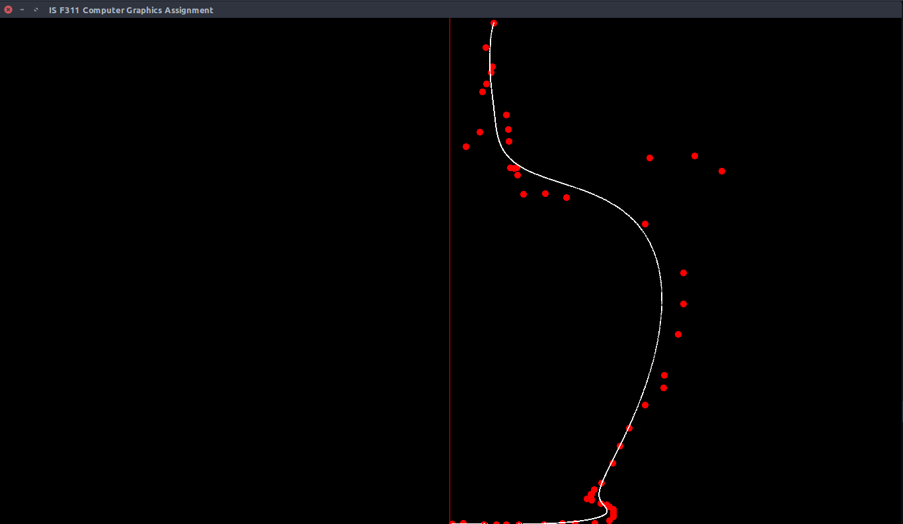

# Assignment 3
Implementation of de Casteljau algorithm for drawing Bezier curves of degree n and the surface of revolution of the drawn curve.

Course Assignment for IS F311- Computer Graphics @ BITS Pilani, Hyderabad Campus.

**Done under the guidance of Prof. Tathagata Ray, Associate Professor, BITS Pilani, Hyderabad Campus.**

## Table of Contents

- [Assignment 3](#assignment-3)
  * [Instructions to run the scripts](#instructions-to-run-the-scripts)
      - [Interface controls](#interface-controls)
  * [Introduction](#introduction)
    + [Bezier curve](#bezier-curve)
    + [de Casteljau algorithm](#de-casteljau-algorithm)
    + [Example (degree 3 curve)](#example--degree-3-curve-)
  * [Program features](#program-features)
  * [Results](#results)
    + [Wine glass](#wine-glass)
    + [Champagne glass](#champagne-glass)
    + [Grail](#grail)
    + [Urn](#urn)
    + [Milk Bottle](#milk-bottle)
    + [Gourd Vase](#gourd-vase)
    + [Round Vase](#round-vase)
    + [Mushroom](#mushroom)
  * [Members](#members)

<small><i><a href='http://ecotrust-canada.github.io/markdown-toc/'>Table of contents generated with markdown-toc</a></i></small>


## Instructions to run the scripts
Run the following commands to launch the curve drawing interface:

```cpp
g++ *.cpp -lglfw -pthread -lGLEW -lGLU -lGL
./a.out
```

#### Interface controls

| Control | Action                                              |
|---------|-----------------------------------------------------|
| LMB     | Add point (in add mode)/ Move points (in move mode) |
| RMB     | Delete point                                        |
| M       | Toggle Move mode                                           |
| A       | Togle Add mode                                            |
| Space   | Write OFF file to disk                              |

## Introduction

### Bezier curve

A Bezier curve is a parametric curve frequently used in computer graphics and related fields. Bezier curves are completely contained within the convex hull formed by the control points. The blending functions of Bezier curves are Bernstein polynomials which are of the form- 


The Bezier curve has the equation-


### de Casteljau algorithm

De Casteljau's algorithm is a recursive method to evaluate polynomials in Bernstein form or Bézier curves.

### Example (degree 3 curve)

**1. q<sub>0</sub> = Lerp(t, p<sub>0</sub>, p<sub>1</sub>), q<sub>1</sub> = Lerp(t, p<sub>1</sub>, p<sub>2</sub>), q<sub>2</sub> = Lerp(t, p<sub>2</sub>, p<sub>3</sub>)**  


**2. r<sub>0</sub> = Lerp(t, q<sub>0</sub>, q<sub>1</sub>), r<sub>1</sub> = Lerp(t, q<sub>1</sub>, q<sub>2</sub>)**  


**3. x = Lerp(t, r<sub>0</sub>, r<sub>1</sub>)**  


**4. Final point**  
  


**When the above steps are repeated across a large no. of values of t between 0 and 1, the following curve results.**  


**Blending functions**  


## Program features
Our program has the following features:
1. An interactive GUI to plot points. The resulting bezier curve from the points is generated and displayed in real-time.
2. The ability to move and remove plotted points.
3. The curve is rotated about y-axis to generate the surface of rotation. The resulting surface is stored in OFF format and can be viewed using software such as MeshLab, noesis, etc.


## Results

### Wine glass


### Champagne glass


### Grail


### Urn


### Milk Bottle


### Gourd Vase



### Round Vase


### Mushroom


## Members
[Shubham Jha](http://github.com/shubhamjha97)

[Praneet Mehta](http://github.com/praneetmehta)

[Keyur Jain](https://github.com/keyursjain)